# C到C++
[C/CPP参考手册](https://en.cppreference.com/w/)

C++是C的超集， C 有29个头文件，C++新增了58个头文件

大量的关键字是为了把运行时的潜在错误转到编译阶段

|            | C语言 | C++  |
| ---------- | ----- | ---- |
| 面向过程   | 对    | 对   |
| 面向对象   |       | 对   |
| 泛型编程   |       | 对   |
| 函数式编程 |       | 对   |

*学习语言的 重点 是学习编程范式。*

要了解程序内部的执行具体逻辑和顺序

# 封装

## STL

### queue


队列：

头文件： queue

命名空间： std

声明：queue<data_type> q;

| q.front() | 查看队首元素 |
| --------- | ------------ |
| q.empty() | 队列判空     |
| q.push()  | 入队         |
| q.pop()   | 出队         |
| q.size()  | 队列元素数量 |

### string

字符串：

头文件： string

声明： string s1;

| s1 == s2    | 字符串判等                   |
| ----------- | ---------------------------- |
| s1 < s2     | 字典序小于                   |
| s1 > s2     | 字典序大于                   |
| s1 += s2    | 字符串连接                   |
| s1.length() | 字符串长度(时间复杂度：O(1)) |

### hash_map

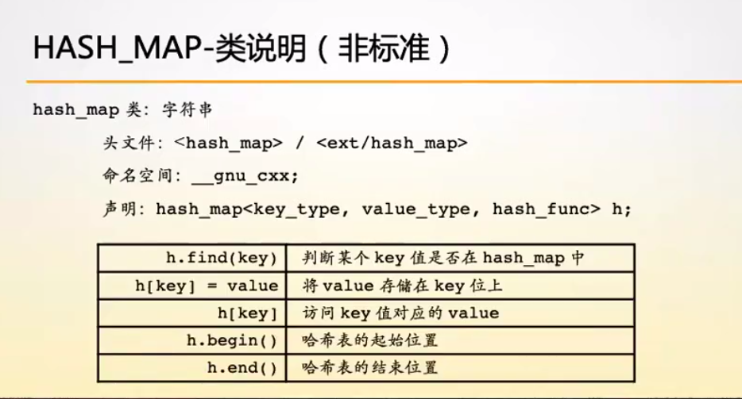


非排序：

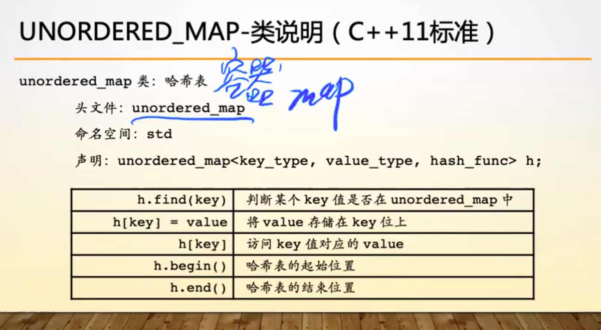

### map

map的底层是红黑树，所以是按照排序输出的（从小到达），而unordermap是乱序的，和输入也没有关系

### set

自带排序（从小到达），自带去重

### 排序

sort(a, a + n, cmp) // 左闭右开，默认升序

nth_element(a, a + 1, a + n) //快速选择排序O(n),值保证a[1]时是正确的位置


## 类和对象

类型 = 类型数据 + 类型操作

属性和方法：即数据和操作

## 访问权限

友元函数：可以访问私有的

```c++
class People {
	friend int main(); // 友元函数int main()可以访问People内部的成员和方法
    int x, y;
}
```

struct : 默认是public

类里面的权限默认是私有的。

向下兼容C语法，有struct 类，默认是共有的。

this指针：指向当前对象

## 类属性和方法

```C++
class People {
private:
    static int total_num;//表示成员的总数，构造加一，析构减一
}
```

### 类型强转

static_cast

const_cast

dynamic_cast

reinterpret_cast

### const方法

不改变语义和内容

作用：const对象只能调用const方法,非const对象也可以访问const方法

```C++
class People{
	//const 
    void seek() { // 被必须是void seek() const
		cout << x << " " << y << endl;
    }
private:
    mutable int cnt;
    int num;
}
const People e(2, 3);
e.seek() //编译出错，因为seek, 不是const方法
```

const 放在函数前和放在函数后的区别：

放在函数前：表示返回值是一个常量

放在函数后：表示成员数据不可修改。

#### mutable 

所有加mutable的变量才可以在const方法中修改

```C++
void seek() const{
	this->num += 1;//失败报错
    this->cnt += 1;//成功
}
```


# 构造函数和析构函数

| 构造/析构函数            | 使用方式                                  |
| ------------------------ | ----------------------------------------- |
| 默认构造函数             | People a;                                 |
| People(string name);     | People a("yu");// People a = sting("yu"); |
| People(const People &a); | 拷贝构造，与 = 不等价                     |
| ~People();               | 无                                        |

先构造的后析构：后产生的信息可能依赖于以前的信息

权限：public

自动调用，一个申请资源，一个释放资源

当有参函数时有一个参数相当于转换构造。默认构造就不在存在。

```C++
People(int a) {
	this->x = a;
}
add(People a, People b) {
	return a.x + b.x;
}
ans = add(1, 2); // ans = 3,函数传参时可以进行类型转换
People c = 2;// People c(2);
```

默认构造函数：

```C++
People() = default; // 此类函数使用默认构造函数
People() = delete;// 此类函数被删除
```

目的：

将隐藏的规则变为显示的规则，便于找bug

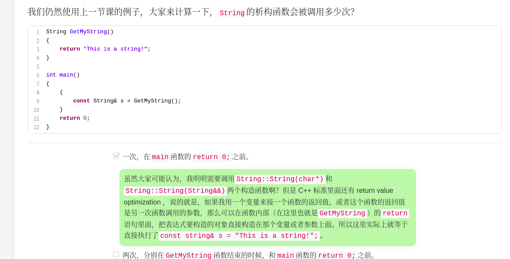

## 类的所有权和智能指针

### 类对成员的所有权

C++里的对象所有权的关系，指的是谁负责delete谁的关系。

#### 独占所有权

如果A对B有独占所有权的话，那么A  delete  B。因为是独占，所以C想要持有B的话，A就必须放弃对B的所有权，并把他的成员变量设置为nullptr。转移后的C对象同样是拥有独占的特性。


### 智能指针shared_ptr

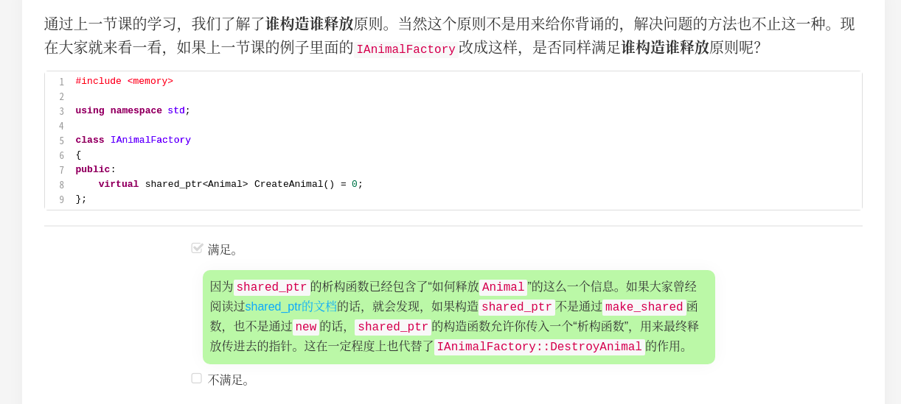

只要将 new 运算符返回的指针 p 交给一个 shared_ptr 对象“托管”，就不必担心在哪里写delete p语句——实际上根本不需要编写这条语句，托管 p 的 shared_ptr 对象在消亡时会自动执行delete p。而且，该 shared_ptr 对象能像指针 p —样使用，即假设托管 p 的 shared_ptr 对象叫作 ptr，那么 *ptr 就是 p 指向的对象。

通过 shared_ptr 的构造函数，可以让 shared_ptr 对象托管一个 new 运算符返回的指针，写法如下：

```C++
shared_ptr<T> ptr(new T);  // T 可以是 int、char、类等各种类型
```


### 引用

相当于绑定

```C++
void add_num(int &a) {
	a += 1;
    return ;
}
// 调用
add_num(0); // 会输出1
```

### 拷贝构造函数

```C++
People(const People &a) {
	this->name = a.name;
}
```

如果是People(People a)编译直接报错:

`````C++
People a = b;
先执行People (People a = b) // 实参到形参,接下来还会进行People(a = b) , 一直调用
`````

#### 深拷贝和浅拷贝

浅拷贝：

默认拷贝是直接复制，两个指针是指向同一个空间

深拷贝：自己动手构造

### [ C++ 构造函数后加冒号](https://www.cnblogs.com/qingyuanhu/p/4301691.html)

初始化列表。

## 返回值优化

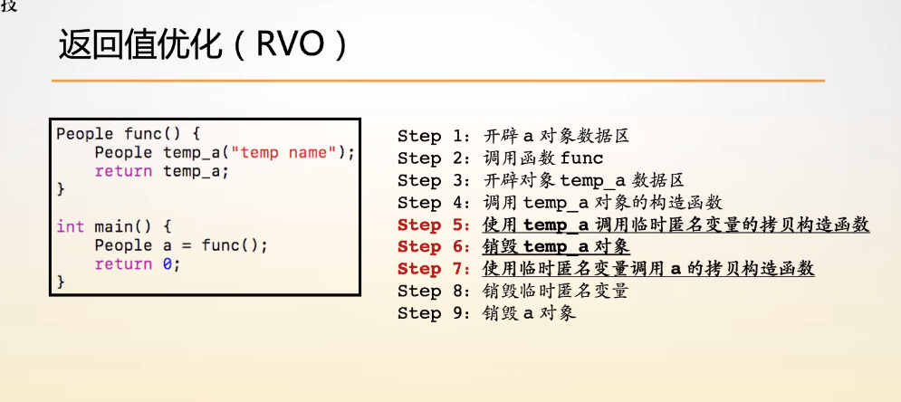

一共两次拷贝行为。

编译器优化后无拷贝。

**成员函数参数里面有一个隐藏的this, 编译器会自动加进去。** 所以也可以修改this指针

## 运算符重载

重载不能改变运算符的优先级和传入参数个数

类内和类外重载重载：

类内重载相当于 class.method()

类外重载相当于 标准的运算符

注意符号的优先顺序，同时有类内重载的时候，优先使用类内重载

```C++
#include <iostream>
#include <algorithm>
using namespace std;

namespace haizei {
    class istream{
    public:
        istream &operator>>(int &n) {
            std::cin >> n;
            return *this;
        }
    private:

    };
    class ostream{
    public:
        ostream &operator<<(int &n) { // 加&引用，防止多余的拷贝
            std::cout<< "haizei : ";
            std::cout << n;
            return *this;
        }
        ostream &operator<<(const char *msg) { // string 是一个类， 如果写string的话，要有一个char *到string 的构造，变慢
            std::cout << msg;
            return *this;
        }

    private:

    };
    istream cin;
    ostream cout;

}

haizei::ostream &operator<<(haizei::ostream &out, double &k) {
    std::cout << k;
    return out;
}
ostream &operator+(ostream &out,const int &n) { // 必须加入const, 不可修改 常量 n
    std::cout << n;
    return out;
}
int main() {
    int n, m;
    //haizei::cin >> n >> m; //返回void operator>> 类型 不支持连续读 
    haizei::cin >> n >> m; // haizei::cin.operator(n)
    haizei::cout << n << " " << m << "\n";
    double k = 5.6;
    haizei::cout << k << "\n";
    ((((cout + 3) << " ") + 4 )<< " ") + 5;
    return 0;
}
```

### 前++ 和 后++：

```C++
    Point &operator++() { // ++a (前)
        this->__x++;
        this->__y++;
        return *this;
    }
    Point operator++(int) { // a++（后)  // 不能返回引用， 引用是一个标签，temp生存周期只在此函数
        Point temp(*this);
        __x++;
        __y++;
        return temp;
    }
```

### 函数对象/ 指针对象/ 数组对象

[重载 ()、-> 、 []](/home/yuzhendi/海贼/C++/第一阶段/运算符重载/3.cpp)

间接引用运算符：->

这三类运算符和 = 只能在类内重载

### 不能重载运算符

 ```C++
 '.'
 成员指针引用运算符'.*' '->*'
 'sizeof'
 三目运算符 '? : '
 域 '::'
C++的基础体系
 ```

# 继承

## 父类向子类转换

### dynamic_cast

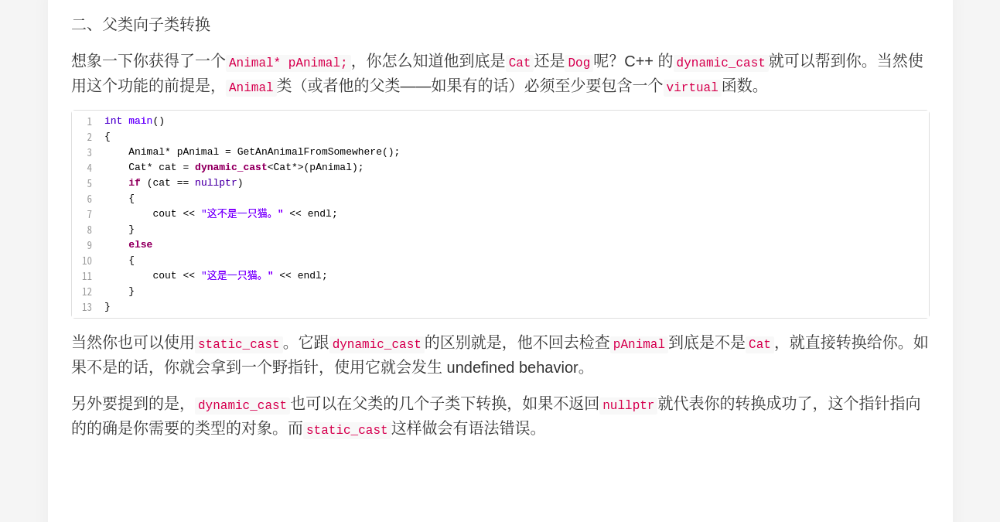

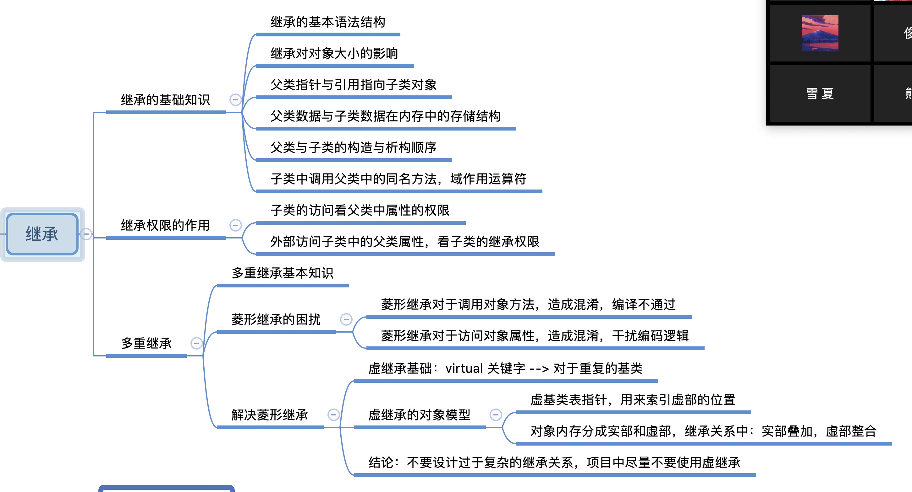

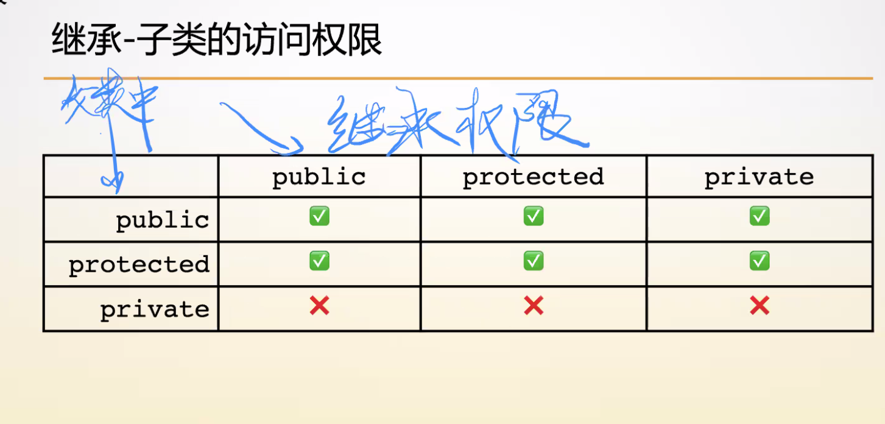

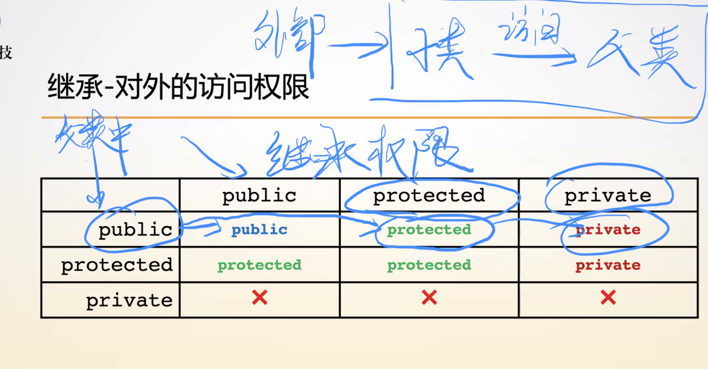

**继承权限影响外部对于子类内部继承自父类的属性和方法的访问权限，访问权限只能变的更低或不变，不能提升。**

全部继承：功能的有效性取决于数据的完整性

构造函数：

调用子类，父类完成构造->子类构造执行

[代码演示](/home/yuzhendi/海贼/C++/第一阶段/继承)

### virtual解决菱形继承问题

[4.problem](/home/yuzhendi/海贼/C++/第一阶段/继承)

菱形继承：B继承A， C继承A， D继承B和C，那么D的存储空间里就有两个A，会使得访问元素的时候指向不明。

真正的C++工程开发的时候是不提倡多重继承的，virtual虽然解决了菱形继承问题，但是存储空间要求更大了。

虚继承：对象内存分成实部和虚部，实部叠加，虚部整合

#### 虚析构

防止子类对象转到父类指针调用析构函数时，只析构父类对象

## 友元函数

友元函数赋予权限，是不能被继承的

# 多态

## 虚函数


<u>普通的成员方法依赖于类走的</u>

<u>虚函数跟着对象走：一个父类数组可以有多个不同类型的子类对象</u>


```C++
#include <iostream>
#include <algorithm>
using namespace std;

class Animal {
public:
    virtual void run() { // 加入virtual可以是的函数跟着对象走
        cout << "Animal " << endl;
    }
};

class Cat : public Animal{
public:
    void run() override{ // override 不影响功能的实现， 可以将潜在bug显示 判断子类和父类的虚函数一致
        cout << "cat" << endl;
    }
};

int main() {
    Cat a;
    Animal &b = a;
    Animal *c = &a;
    a.run(); // 普通的成员方法是依赖于类走的 cat
    b.run(); // Animal
    c->run(); // Animal
    return 0;
}
```

<u>在拥有继承关系的类里面，父类的析构函数必须是虚函数，否则容易造成内存泄漏</u>：

```C++
class Base_A : public Base{}    
Base *ba = new Base_A(); 
delete ba; // 只会析构父类， 不会析构子类， 会造成内存泄漏， 因为析构函数时普通成员方法， 跟着类走， 调用~Base

```


编译期状态

运行时状态：需要额外的东西来记录

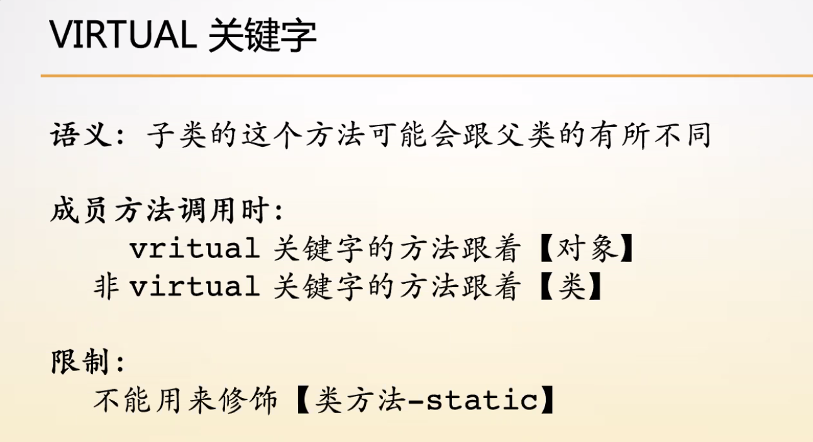

### 实现原理

对象存储空间会多一个指针（头8个字节，替换父类地址），指向虚函数表（存放虚函数的方法，即函数地址）

**成员函数参数里面有一个隐藏的this, 编译器会自动加进去。**

## 纯虚函数

在父类上 = 0， 被称为接口类或者抽象类

```C++
virtual void run() = 0;
```

特点：功能未定以，抽象类（接口类），不能生成对象，纯虚函数（接口方法）

应用场景：定义接口

### 虚函数表

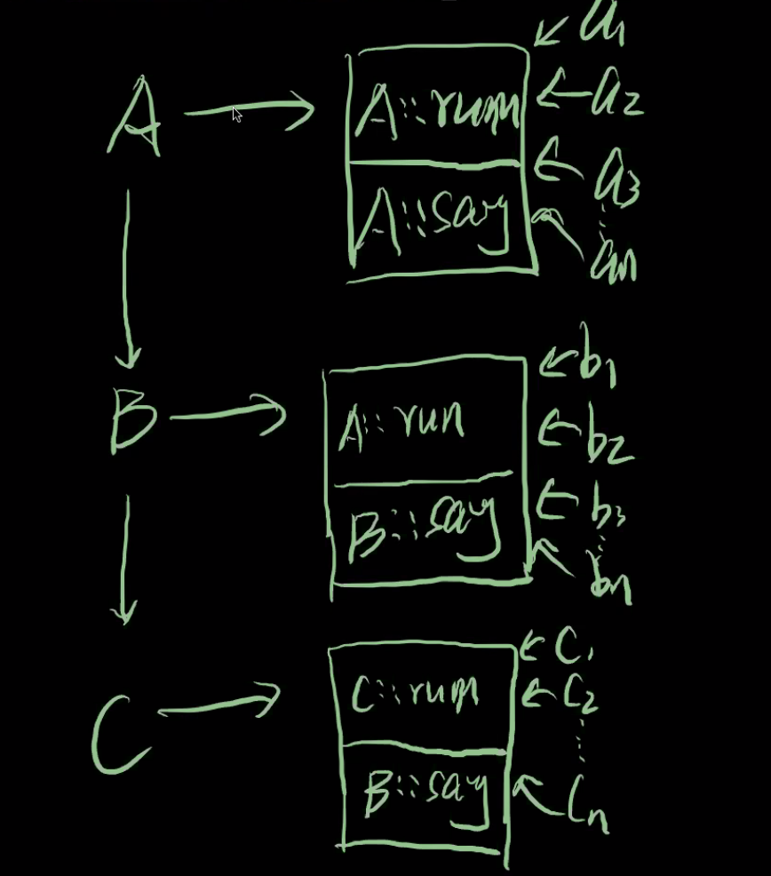

同一个类的对象指向同一个虚函数表

## 四类转换方法

### dynamic_cast

要求父类是多态的。

原理：利用相同对象具有用一个虚函数表的性质来进行表地址的比较。

[dynamic](/home/yuzhendi/海贼/C++/第一阶段/多态)

## 关键字

[代码](/home/yuzhendi/海贼/C++/第一阶段/关键字)

### static

（1）类的静态函数和类无关

（2）类的静态函数可以在未实例化前调用

（3）定义函数指针指向普通成员函数时，需要取类的地址，而调用时每一个实例有自己的函数指针

（4）用函数指针调用静态成员函数时，仅需要指定类名

只要这个静态变量的类型不是一个`const`的整数类型（或者整数的兼容类型，如`enum`和`char`等），那么你写在类里面的那个静态变量其实只是一个声明，你还需要定义它。下面的代码说明了具体的过程：

```C
struct MyClass {
  static const int A = 0;
   static string B;
};
sting MyClass::B = "我是一个静态字符串变量"
```

静态函数：

顾名思义，静态函数不是属于类的实例的函数，而是属于类本身的函数。所以静态函数里面无法访问`this`对象，自然那些`virtual`、`override`、`const`、`&`和`&&`等修饰符，也不能添加到静态函数身上。

### auto

自动申请和释放空间

自动推倒变量的类型（编译期间就确定）

不能作用的场景：函数参数、模板参数、定义数组、不能用于非静态成员变量

### constexpr

声明常量表达式

与const的区别：

const 是运行期间变量：

```C++
int n;
cin >> n;
const int m = n * 2;
```

constexpr是严格的编译期常量，要求整个过程都是常量！

```C++
constexpr int m = 12 + 1; // = 右边也必须是编译期常量
/*********************/
//调用函数的时候也必须在函数前加上constexpr,函数可以正常调用
constexpr int f(int x){ return x + 1;}
constexpr int m = f(2);
// 对于类的类的函数同样适用
```

### final

防止子类对与父类的对应方法的覆盖重写

```C++
void say final override()
```

不允许类再被继承

```C++
class A final {}
```

### nullptr

本质是一个地址

NULL本质是一个0，可以看作一个地址。

### override

防止子类改写父类函数使函数名不匹配的问题。

## 左、右值引用

左值：同样的变量，单一的方式，同样的结果。

右值表临时。

(++i) 是左值

(i++) 是右值

左值优先绑定到左值引用上，右值优先绑定到右值引用上。

```C++
void f(int &x){} // 左值引用
void f(int &&x){} // 右值引用
//奇数个&是左值引用
//偶数个&是右值引用
```

```C++
void f(int &&x) {
	f(x); // 传入的是左值
    f(forward<int &&>(x)); // 右值引用的方式向下传递
    f(move(x)); // move强制变成右值
}
```

### move construct移动构造

只需移动一个指针O(1)普通的构造是O(n)的，

深拷贝要求所有内容一个个拷贝,O(n)复杂度

右值拷贝的时候会出现多余的匿名变量之间的拷贝，临时变量，会进行析构释放，这个操作多余。

这里用一个指针直接移动到匿名变量的空间里，然后让原来的指向空地址nullptr，析构时，空地址就不需要释放空间了，只移动了一次指针，没有进行一个个空间里的拷贝.

# 模板

泛型编程：将**任意类型**从**程序设计**中和抽象出来

作用在编译之前

模板的实例化：编译器确定类型的方法

nm -C + 目标文件可以查看声明和定义(T是当前的文件里，U是其他文件里)

源文件->编译->链接->目标文件

### 模板的特化

模板函数：

```C++
template <typename T>
T add(T a, T b) {
    return a + b;
}
```

当我们需要特殊的情况下时候，需要用到模板函数特化：

```C++
template <>
T add(T a, T b) {
    return a + b + 2;
}
```

一般函数走到是模板函数，但是传入的是整形变量的时候走模板函数特化。

偏特化：

传入指针时（特化的补充）

```C++
template <>
T add(T *a, T *b) {
    return *a + *b;
}
```

### 变参模板

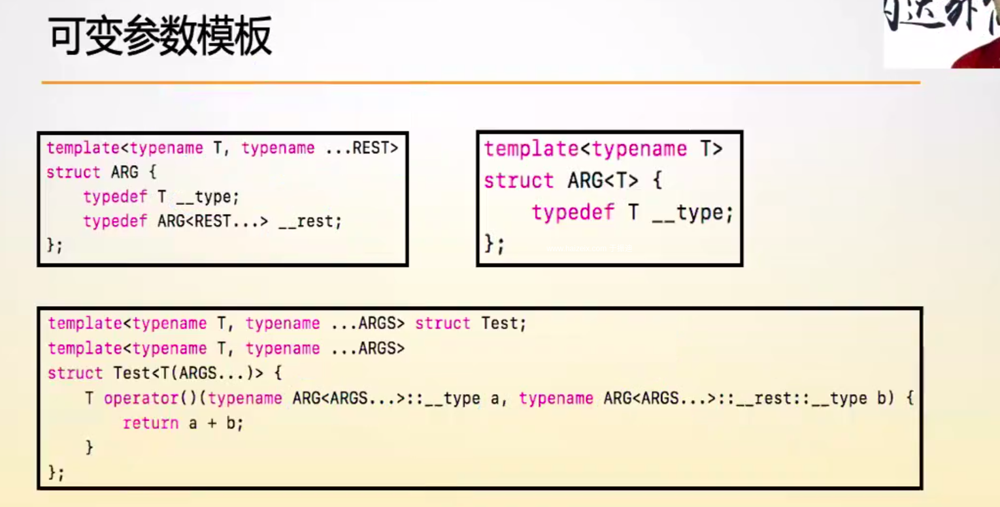

就是对struct ARG 里面的一个的参数和剩余的参数取一个别名

### 模板的图灵完备性

# 多线程

## 加任务和取任务

多线程里我们用到了任务队列，在多线程操作里，任务队列属于临界资源，为了保证多线程安全，我们要用到互斥锁，获取任务时(pop操作)，要加一个互斥锁，保证获取任务时（push操作)添加任务不能同时访问任务队列的同一片存储空间，同杨的，添加任务也要加锁。还有一个问题就是，取任务(pop)时，队列可能为空，这个时候就要等待添加任务完成（完成后有一个信号的通知），由于这个时候（pop）操作已经占用互斥锁，所以要用到条件信号量的等待（等待push的信号通知，同时将互斥锁释放，当接受到信号两之后，重新加上互斥锁）

# 设计模式

## 虚函数和visitor模式的对比

虚函数：

- 好处：容易写对，毕竟你只要往基类添加一个纯虚函数，所有的子类都要去覆盖他，否则会有编译错误，不会找漏。
- 坏处：需求会越加越多，每个类变得很大，你就需要分开文件存放。每当你添加一个新需求的时候，你都得修改所有的子类的文件。

**Visitor 模式**

- 好处：写起来非常简单，你只要从`IVisitor`继承下来一个新的类就可以了。

- 坏处：N/A

  #### 添加新子类

  **虚函数**

  - 好处：比较方便，你只需要继承下来一个类，自动就会知道应该实现多少虚函数。
  - 坏处：每一个类都拥有所有相关的需求的碎片，代码读起来很难。

  **Visitor 模式**

  - 好处：容易写对，因为如果你往`IVisitor`里面添加了一个新的虚函数，编译器会告诉你所有需要修改的地方。
  
  - 坏处：每一个`IVisitor`的子类都需要修改。
## new 和 delete

实际上时运算符

# 异常

    ## 异常处理

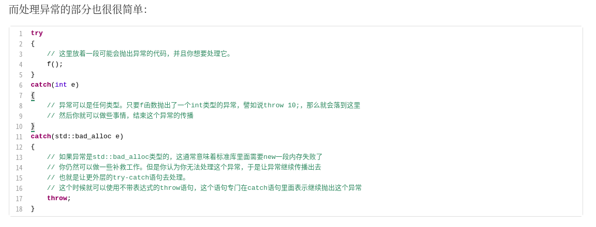

