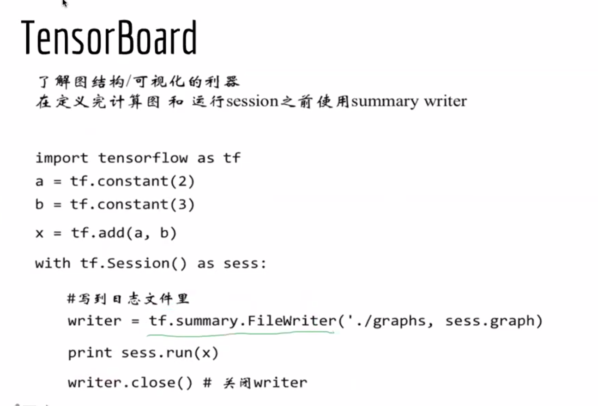

# 人工智能

## jupyter

打开方法： 

```shell
jupyter notebook
```

使用方法：

new + python3 新建项目

Shift + enter 执行命令

## tensorboard

查看可视化图：

进入所在目录：

```shell
tensorboard --logdir=./graphs --port=8008
```

进入网页：

http://127.0.0.1:8008即可查看结果



# 从拟合到深度神经网络