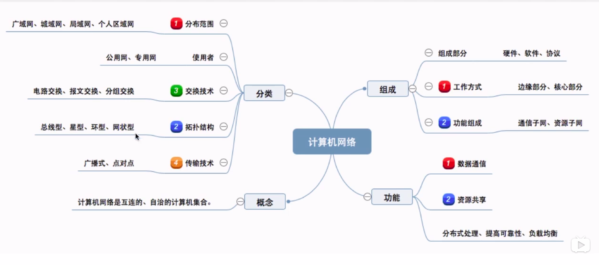
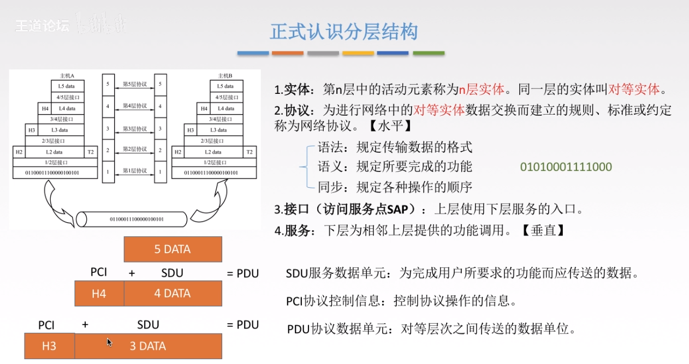
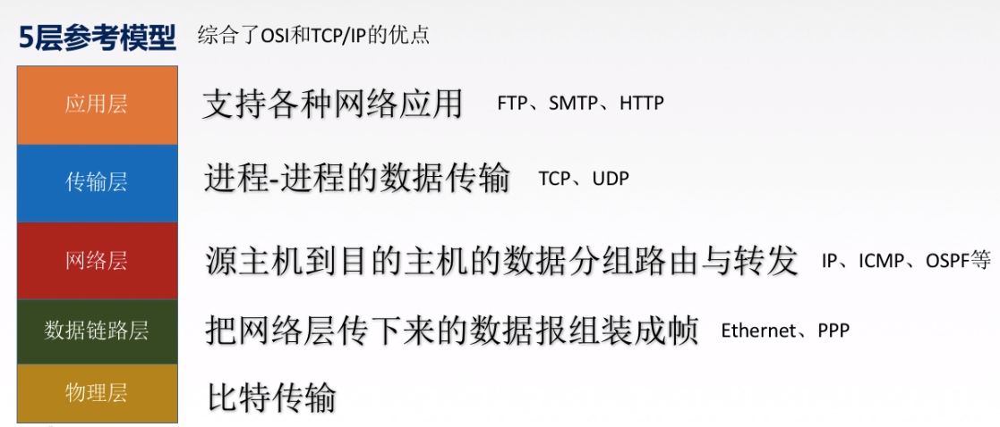
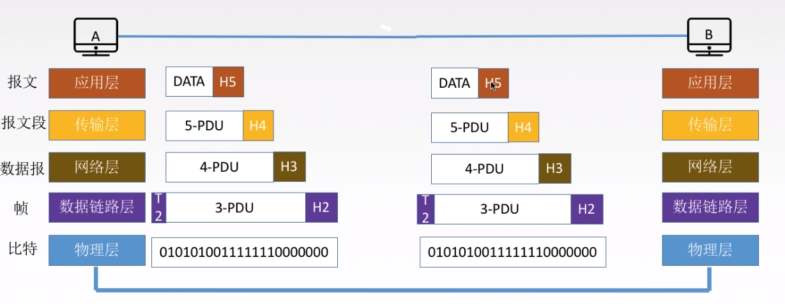
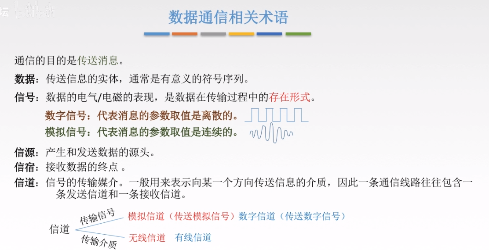

# 概述

## 计算机网络的功能

1. 数据通信
2. 资源共享

## 计算机网络的组成

- **组成部分**：硬件、软件、协议

- **工作方式**：

  边缘部分（用户和直接使用：C/S  和 P2P）

  核心部分：网络和路由器

## 计算机网络的分类

1. 按照分布范围：广域网WAN、城域网MAN、局域网WAN、个人局域网PAN

2. 按照使用者：专用网、功用网

3. 交换技术：电路交换、报文交换、分组交换

4. 拓扑结构：总线、星型、分组

5. 传输技术：广播和点对点

   

## 速率相关的性能指标

### 速率

定义：连接在计算机网络上的主机在数字信道上传送数据位数的速率
单位:b/s,Kb/s,Mb/s,Tb/s，
如果用字节表示，则是B/s,KB/s,MB/s,TB/s
1Byte=8bit

### 带宽

在计算机网络中，指的是网络设备所支持的最高速度，单位同速率，是**理想条件下最高速率**

### 吞吐量

单位时间内通过某一个网络（或者信道和接口）的数据量

## 时延、时延带宽积、RTT和利用率

### 时延

发送时延：数据长度/信道带宽

传播时延：信道长度/电磁波在信道的传播速率

排队时延：

处理时延：

### 时延带宽积

时延带宽积=传播时延*带宽

即：容量，某一信道容纳的数据量

### 往返时延RTT

从发送数据开始（数据放到信道上开始计算），到发送方受到接受方的确认。

包括：传播时延*2 + （处理时延）

### 利用率

信道利用率=有数据通过时间/总时间

网络利用率=信道利用率的加权平均值

## 分层结构

## 第一章总结

# 物理层

通信基础

两个公式 求极限lim

传输介质

物理层设备

## 基本概念

传输数据比特流

## 四个特性

机械特性：

电气特性：

功能特性：

规程特性（过程特性）：

### 数据通信基础知识

#### 数据通信相关术语

#### 三种通信方式

1. 单工通信：单方向，仅一条通道
2. 半双工通信：不能同时接受和发送信息，需要两条信道
3. 全双工通信：可以同时接受和发送信息，两条信道

#### 两种数据传输方式

1. 串行传输：速度慢，费用低，适合远距离
2. 并行传数：速度快，费用高，适合近距离

## 码元、波特、速率、带宽

码元：固定时长的信号波形

波特：1波特表示每秒传输一个码元

